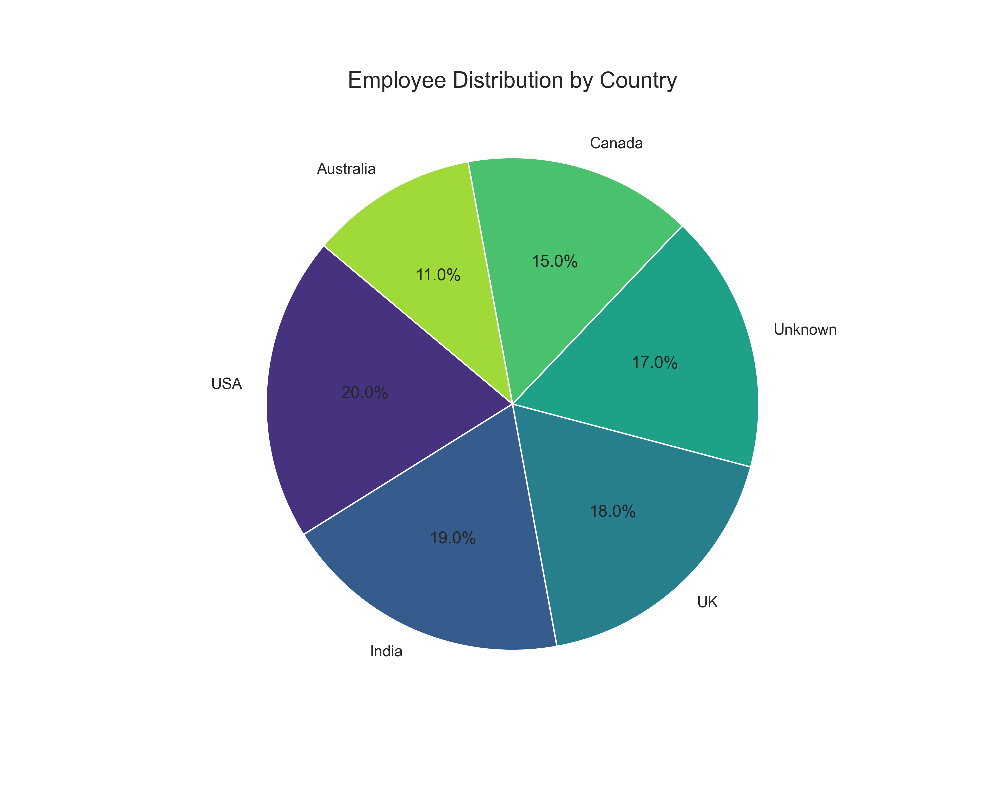
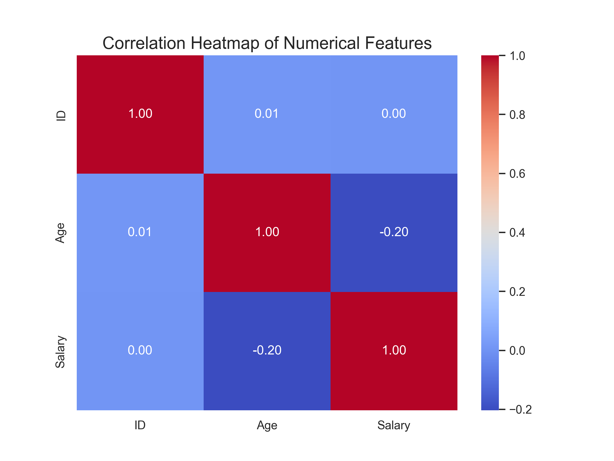

# Advanced Data Cleaning and Reporting Pipeline

 
 
 

This repository contains a robust, object-oriented data processing pipeline built with Python. It automates the entire workflow of cleaning a dataset, generating advanced static and interactive visualizations, and compiling the results into a comprehensive PDF report.

# Table of Contents
- Project Overview
- Key Features
- Project Structure
- Getting Started
- How to Run the Pipeline
- Pipeline Outputs
- Future Enhancements
- Contributing
- License
- Contact

# Project Overview
This project transforms a simple data cleaning script into a powerful, reusable pipeline encapsulated in a DataProcessor class. The pipeline executes a sequence of tasks: it loads raw data, performs cleaning and imputation, generates a suite of insightful visualizations, creates a standalone interactive HTML dashboard with Plotly, and summarizes the entire process in an auto-generated PDF report.

# Key Features
1. Modular, Object-Oriented Pipeline: The entire workflow is structured within a DataProcessor class, making it reusable, maintainable, and easy to extend.
2. Comprehensive Data Cleaning:
 - Handles duplicate removal.
 - Performs strategic missing value imputation for both categorical and numerical data.
 - Standardizes data types for robust analysis.
3. Advanced Static Visualizations:
   - Generates histograms for Age and Salary distributions.
   - Creates a pie chart for a clear view of employee distribution by country.
   - Builds a correlation heatmap to uncover relationships between numerical variables.
4. Interactive HTML Dashboard:
   - Produces a standalone dashboard.html file using Plotly.
   - Allows for dynamic filtering and exploration of the data in any web browser.
5. Automated PDF Reporting:
   - Creates a professional summary_report.pdf using the fpdf2 library.
   - The report includes cleaning statistics, a summary of the data, and all generated visualizations.
6. Organized Output Management: All generated files are neatly saved into a dedicated output/ directory.

# Project Structure
```bash
data-cleaning-and-visualization/
│
├── output/                         # All generated files are saved here
│   ├── visualizations/
│   │   ├── age_distribution.png
│   │   ├── salary_distribution.png
│   │   ├── country_pie_chart.png
│   │   └── correlation_heatmap.png
│   │
│   ├── interactive_dashboard.html  
│   ├── summary_report.pdf          
│   └── cleaned_data.csv            
│
├── dirty_data_for_cleaning.csv     
├── data_cleaning_pipeline.py       
├── requirements.txt                
└── README.md                      

```

# Getting Started
Follow these steps to set up and run the pipeline on your local machine.

##  Prerequisites
- Python 3.6+
- pip package manager

##  Installation
Clone the repository:
```bash
git clone https://github.com/alanspace/data_cleaning_project.git
cd data-cleaning-and-visualization
```


Install the required libraries:
```bash
pip install -r requirements.txt
```

(Note: You will need to create a requirements.txt file containing pandas and matplotlib)

### How to Run
Place your data: Make sure your raw data file (dirty_data_for_cleaning.csv) is in the project's root directory.
Execute the pipeline script from your terminal:

``` bash
python data_cleaning_pipeline.py
Use code with caution.
```

Check the output directory: Once the script finishes, the output/ folder will be populated with the cleaned data, visualizations, dashboard, and PDF report.

# Pipeline Outputs
The pipeline generates several key outputs:

1. Static Visualizations
Saved in the output/visualizations/ directory.

Pie Chart for Country Distribution	Correlation Heatmap


2. Interactive Dashboard (interactive_dashboard.html)
An HTML file that you can open in any web browser to interactively explore the data.

3. PDF Summary Report (summary_report.pdf)
A multi-page document that summarizes the entire analysis, perfect for sharing with stakeholders.


# Future Enhancements
While this pipeline is robust, it can be extended even further:

Command-Line Arguments: Add argparse to allow users to specify input and output file paths from the command line.
Unit Testing: Implement pytest to create tests for the DataProcessor class, ensuring reliability.
Cloud Integration: Add functionality to read data from and save outputs to cloud storage like Amazon S3 or Google Cloud Storage.
Web Application: Deploy the interactive dashboard as a standalone web application using a framework like Flask or Dash.

# Contributing
Contributions are welcome! If you have ideas for improvements or find a bug, please feel free to follow these steps:

# Fork the repository.
Create a new feature branch (git checkout -b feature/YourAmazingFeature).
Commit your changes (git commit -m 'Add some YourAmazingFeature').
Push to the branch (git push origin feature/YourAmazingFeature).
Open a Pull Request.
License
This project is licensed under the MIT License. See the LICENSE file for more details.

# Acknowledgments
A big thank you to the open-source community for providing the amazing tools that made this project possible.
Inspiration for this project came from the need to have a clear and concise workflow for initial data exploration.