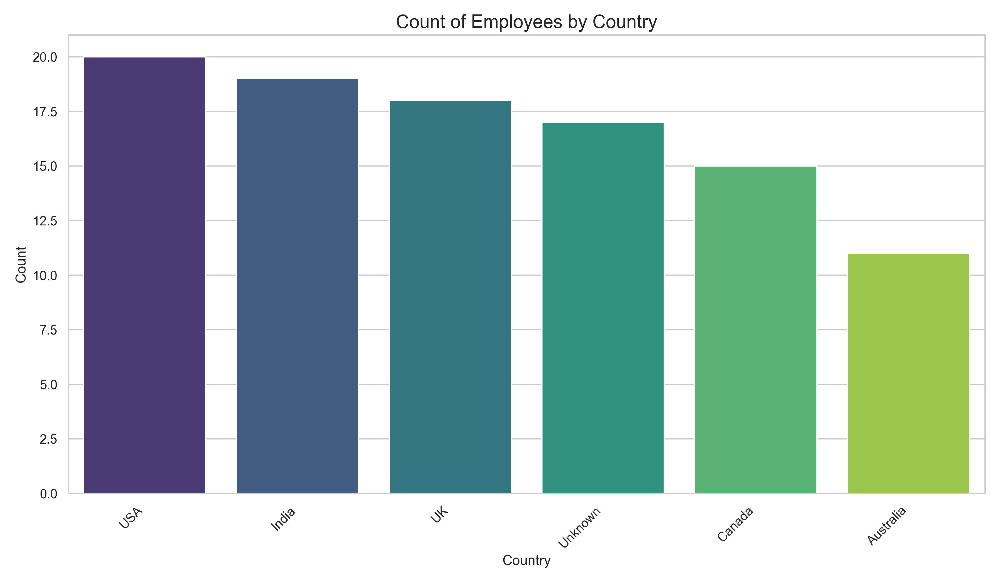

# Data Cleaning and Visualization with Python


A hands-on project demonstrating a robust workflow for cleaning a messy dataset and creating insightful visualizations using Python, Pandas, and Matplotlib. This repository showcases essential data wrangling techniques and the power of data visualization in uncovering underlying patterns.

# Table of Contents
Project Overview
Key Features
Project Structure
Getting Started
Prerequisites
Installation
How to Run
Visualizations
Future Enhancements
Contributing
License
Acknowledgments
Contact

# Project Overview
The primary goal of this project is to take a raw, "dirty" dataset and transform it into a clean, usable format. The process involves identifying and handling common data quality issues such as missing values and duplicates. Once the data is cleaned, I use Matplotlib to create a series of visualizations that provide a clear and concise overview of the dataset's key characteristics. This project serves as a practical example of a fundamental data analysis workflow.

# Key Features
Comprehensive Data Cleaning:
Duplicate Removal: Efficiently identifies and removes duplicate records.
Strategic Missing Value Imputation:
Fills categorical missing data (Name, Country) with "Unknown".
Assigns placeholder values for missing contact information (Email, PhoneNumber).
Imputes missing numerical data (Age, Salary) with the column's mean to maintain statistical integrity.
Standardizes missing JoiningDate with a default value.
Data Type Standardization: Converts JoiningDate to a proper datetime format for time-series analysis.
Insightful Data Visualization:
Country Distribution: A bar chart to visualize the geographical distribution of employees.
Age Demographics: A histogram to understand the age spread of the workforce.
Salary Analysis: A histogram to illustrate the salary distribution across the company.
Data Export:
Saves the clean, analysis-ready dataset to a new CSV file, clean_data.csv.

# Project Structure
```bash
Generated bash
data-cleaning-and-visualization/
│
├── dirty_data_for_cleaning.csv   # The initial, messy dataset.
├── clean_data.csv                # The cleaned, processed dataset.
├── data_cleaning.py              # The core Python script for all operations.
├── README.md                     # You are here!
└── .gitignore                    # To exclude unnecessary files from version control.

```

Use code with caution.
Bash
Getting Started
To get this project up and running on your local machine, follow these simple steps.

# Prerequisites
Make sure you have Python 3.6 or later installed. You will also need pip to install the required libraries.

# Installation
Clone the repository:
Generated bash
git clone https://github.com/your-username/data-cleaning-and-visualization.git
cd data-cleaning-and-visualization
Use code with caution.
Bash
Install the required libraries:
Generated bash
pip install -r requirements.txt
Use code with caution.
Bash
(Note: You will need to create a requirements.txt file containing pandas and matplotlib)
How to Run
Place your data: Ensure your raw data file, dirty_data_for_cleaning.csv, is in the root of the project directory.
Execute the script:
Generated bash
python data_cleaning.py
Use code with caution.
Bash
Check the output:
The script will generate and display three plots.
The cleaned data will be saved as clean_data.csv.
Visualizations
The script will automatically generate the following plots to help you understand the cleaned data:

Employee Count by Country: Highlights the geographical diversity of the workforce.
Age Distribution of Employees: Shows the age demographics.
Salary Distribution of Employees: Provides insights into the salary structure.
(You can include images of your plots here for a more visual README)



# Future Enhancements
I have several ideas for extending this project's capabilities:

Advanced Visualizations: Incorporate a correlation heatmap to explore relationships between numerical variables and use pie charts for a different view of categorical data.
Modular Cleaning Pipeline: Refactor the code into a more structured, object-oriented pipeline that can be easily reused for other datasets.
Interactive Dashboard: Develop an interactive dashboard using Plotly or Dash to allow for dynamic exploration of the data.
Automated Reporting: Generate an automated PDF report summarizing the cleaning process and key findings from the visualizations.
Contributing
I am open to contributions and collaborations! If you have ideas for improvements or have found a bug, please feel free to:

# Fork the repository.
Create a new branch (git checkout -b feature/your-feature).
Commit your changes (git commit -m 'Add some feature').
Push to the branch (git push origin feature/your-feature).
Open a Pull Request.
License
This project is licensed under the MIT License - see the LICENSE.md file for details.

(Note: You would need to add a LICENSE.md file with the MIT license text)

# Acknowledgments
A big thank you to the open-source community for providing the amazing tools that made this project possible.
Inspiration for this project came from the need to have a clear and concise workflow for initial data exploration.